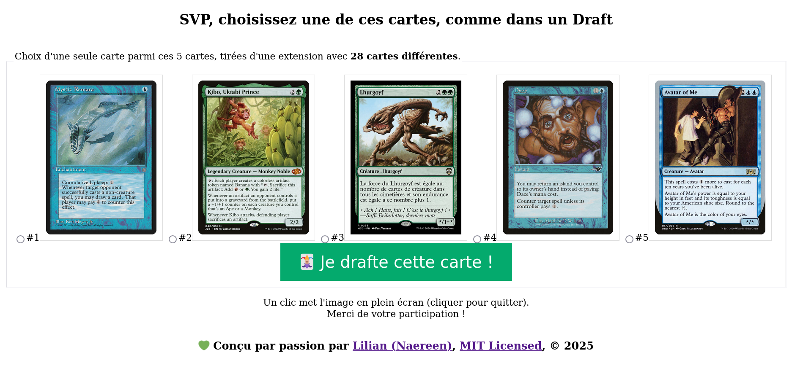
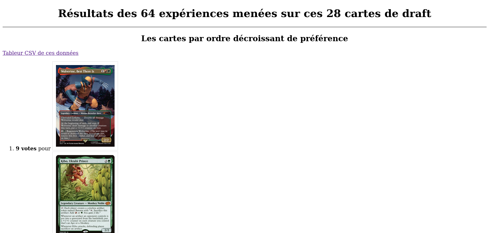

# A-B testing of draft cards

Ce dépôt GitHub héberge le code source, d'une petite application web (PHP + SQLite) pour permettre des expériences de type A/B testing sur des cartes de draft. Cadeau pour un ami !

[Cette application est déployée ici](),
et est conçue pour utiliser des cartes Magic, ou [des cartes du jeu de draft du Hobbit](http://hobbitdraftgame.free.fr/Download.html).

> Fun fact: Ce truc inutile et amusant a été développé seul, en 24h pour mon anniversaire en 2025. Je n'avais jamais fait de PHP, et je n'avais en fait jamais utilisé mes connaissances théoriques de SQL (SQLite) pour un vrai projet. C'est chose faite. Youpi !

## Un aperçu de ce que cette application propose

### La page pour choisir une carte parmi 5


### La page de résultat de l'expérience menée


## Exemple des fichiers tableur CSV

- [Les statistiques utiles (nombre de votes par cartes) obtenus en développant l'application](csv/statsOnVotes_2025-01-13_03_27.csv) (04:27 le 2025-01-13) ;

```csv
nombresVotes,path
9,sld-1737-wolverine-best-there-is.jpg
9,j22-40-kibo-uktabi-prince.jpg
8,pcy-45-rhystic-study.jpg
8,mom-137-etali-primal-conqueror.jpg
5,lea-232-black-lotus.jpg
[...]
1,dmc-128-abundant-growth.jpg

```

- [Tous les choix faits en développant l'application](csv/statsFullExperiments_2025-01-13_03_26.csv) (04:26 le 2025-01-13) ;

```csv
id,path,date
1,stx-164-biomathematician.jpg,"2025-01-13 02:27:11"
2,pkld-59s-padeem-consul-of-innovation.jpg,"2025-01-13 02:27:13"
3,pcy-45-rhystic-study.jpg,"2025-01-13 02:27:14"
4,lea-232-black-lotus.jpg,"2025-01-13 02:27:16"
```

----

## :scroll: License ? [](https://github.com/Naereen/A-B-testing-of-draft-cards/blob/master/LICENSE)
Le code source de ce projet est publié sous les termes de la [License MIT](https://lbesson.mit-license.org/) (fichier [LICENSE](LICENSE)).
© [Lilian Besson](https://GitHub.com/Naereen), 2024.

Les images des différentes cartes ne sont pas ma propriété, mais celle de leurs auteurs respectifs (notamment [Wizards of the Coast](https://magic.wizards.com/)).

[](https://GitHub.com/Naereen/A-B-testing-of-draft-cards/graphs/commit-activity)
[](https://GitHub.com/Naereen/ama)
[](http://ForTheBadge.com)
[](https://GitHub.com/)
[](http://ForTheBadge.com)
[](http://ForTheBadge.com)
[](http://ForTheBadge.com)
[](http://ForTheBadge.com)
